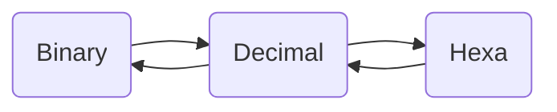

# EVENT LISTENERS and DOM

### This page contains : 
* A span element whose content chages when you press 'click me' button and a event counter of type 'mouseover'
* A text box in which mouse co-ordinates are displayed when hovered
* A X-inspired characters count chat box
* A converter tool which converts
